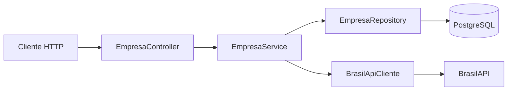

# API de Cadastro de Empresas

Projeto desenvolvido como desafio prático de um curso de **Design Patterns**. A aplicação disponibiliza uma API REST para cadastrar e gerenciar empresas por CNPJ, consultando automaticamente seus dados cadastrais na [BrasilAPI](https://brasilapi.com.br/).

## Sobre o projeto

Ao cadastrar uma empresa, a aplicação consulta a BrasilAPI para obter informações como razão social, nome fantasia, município, UF e situação cadastral. Esses dados são associados ao tipo de relacionamento informado pelo usuário e armazenados em um banco PostgreSQL.

O projeto demonstra separação de responsabilidades em camadas e conceitos como Repository Pattern, DTOs, injeção de dependências e integração com um serviço externo por meio de um cliente HTTP declarativo.

## Tecnologias

- Java 21
- Spring Boot 4
- Spring Web MVC
- Spring Data JPA
- Spring Cloud OpenFeign
- PostgreSQL
- Lombok
- Maven

## Arquitetura



A aplicação está organizada nas seguintes responsabilidades:

- **Controller:** recebe as requisições HTTP e devolve as respostas da API.
- **Service:** concentra as regras de negócio e coordena as integrações.
- **Repository:** realiza a persistência e a consulta das empresas.
- **DTOs:** definem os dados de entrada, saída e integração externa.
- **Exception Handler:** padroniza as respostas de erro da aplicação.

## Pré-requisitos

Antes de executar o projeto, instale:

- Java 21
- Maven 3.9 ou superior
- PostgreSQL

Também é necessário acesso à internet para consultar a BrasilAPI durante o cadastro de uma empresa.

## Configuração do banco de dados

Crie um banco PostgreSQL chamado `desingpatterns`:

```sql
CREATE DATABASE desingpatterns;
```

Defina as credenciais de acesso por meio das variáveis de ambiente:

```bash
export DATABASE_USERNAME=seu_usuario
export DATABASE_PASSWORD=sua_senha
```

No PowerShell:

```powershell
$env:DATABASE_USERNAME="seu_usuario"
$env:DATABASE_PASSWORD="sua_senha"
```

> [!WARNING]
> A configuração atual usa `spring.jpa.hibernate.ddl-auto=create-drop`. Por isso, as tabelas são criadas ao iniciar a aplicação e removidas quando ela é encerrada, incluindo os dados cadastrados.

## Como executar

Clone o repositório, acesse a pasta do projeto e execute:

```bash
mvn spring-boot:run
```

A API ficará disponível, por padrão, em:

```text
http://localhost:8080
```

Para executar os testes:

```bash
mvn test
```

## Endpoints

A rota base da API é `/v1/empresas`.

| Método | Endpoint | Descrição | Resposta de sucesso |
| --- | --- | --- | --- |
| `GET` | `/v1/empresas` | Lista todas as empresas cadastradas | `200 OK` |
| `GET` | `/v1/empresas/{cnpj}` | Busca uma empresa pelo CNPJ | `200 OK` |
| `POST` | `/v1/empresas` | Consulta a BrasilAPI e cadastra uma empresa | `201 Created` |
| `PATCH` | `/v1/empresas/tipoRelacionamento` | Atualiza o tipo de relacionamento | `202 Accepted` |
| `DELETE` | `/v1/empresas/{cnpj}` | Exclui uma empresa | `204 No Content` |

### Cadastrar uma empresa

Os tipos de relacionamento aceitos são:

- `CLIENTE`
- `FORNECEDOR`
- `PARCEIRO`
- `PROSPECT`

```bash
curl --request POST \
  --url http://localhost:8080/v1/empresas \
  --header 'Content-Type: application/json' \
  --data '{
    "cnpj": "00000000000191",
    "tipoRelacionamento": "CLIENTE"
  }'
```

O CNPJ é utilizado para consultar os dados da empresa na BrasilAPI. Em caso de sucesso, a API responde com `201 Created` e sem corpo.

### Listar todas as empresas

```bash
curl --request GET \
  --url http://localhost:8080/v1/empresas
```

Exemplo de resposta:

```json
[
  {
    "cnpj": "00000000000191",
    "razaoSocial": "EMPRESA EXEMPLO S.A.",
    "nomeFantasia": "EMPRESA EXEMPLO",
    "municipio": "BRASILIA",
    "uf": "DF",
    "situacaoCadastral": "ATIVA",
    "tipoRelacionamento": "CLIENTE"
  }
]
```

### Buscar uma empresa pelo CNPJ

```bash
curl --request GET \
  --url http://localhost:8080/v1/empresas/00000000000191
```

Quando a empresa não está cadastrada, a aplicação responde com `404 Not Found`.

### Atualizar o tipo de relacionamento

```bash
curl --request PATCH \
  --url http://localhost:8080/v1/empresas/tipoRelacionamento \
  --header 'Content-Type: application/json' \
  --data '{
    "cnpj": "00000000000191",
    "tipoRelacionamento": "FORNECEDOR"
  }'
```

Em caso de sucesso, a API responde com `202 Accepted` e sem corpo.

### Excluir uma empresa

```bash
curl --request DELETE \
  --url http://localhost:8080/v1/empresas/00000000000191
```

Em caso de sucesso, a API responde com `204 No Content`.

## Tratamento de erros

A aplicação pode retornar os seguintes códigos:

| Código | Situação |
| --- | --- |
| `404 Not Found` | Empresa não encontrada no banco local |
| `409 Conflict` | Empresa já cadastrada |
| `500 Internal Server Error` | Erro inesperado ou falha não tratada em uma integração |

Formato atual da resposta de erro:

```json
{
  "messagem": "Empresa não encontrada!",
  "code": 404
}
```

## Estrutura do projeto

```text
src
├── main
│   ├── java/br/com/Ronald/DesingPatternsProject
│   │   ├── controller
│   │   ├── database
│   │   │   ├── model
│   │   │   └── repository
│   │   ├── dtos
│   │   ├── Exception
│   │   ├── handler
│   │   └── service
│   └── resources
│       └── application.yaml
└── test
```
